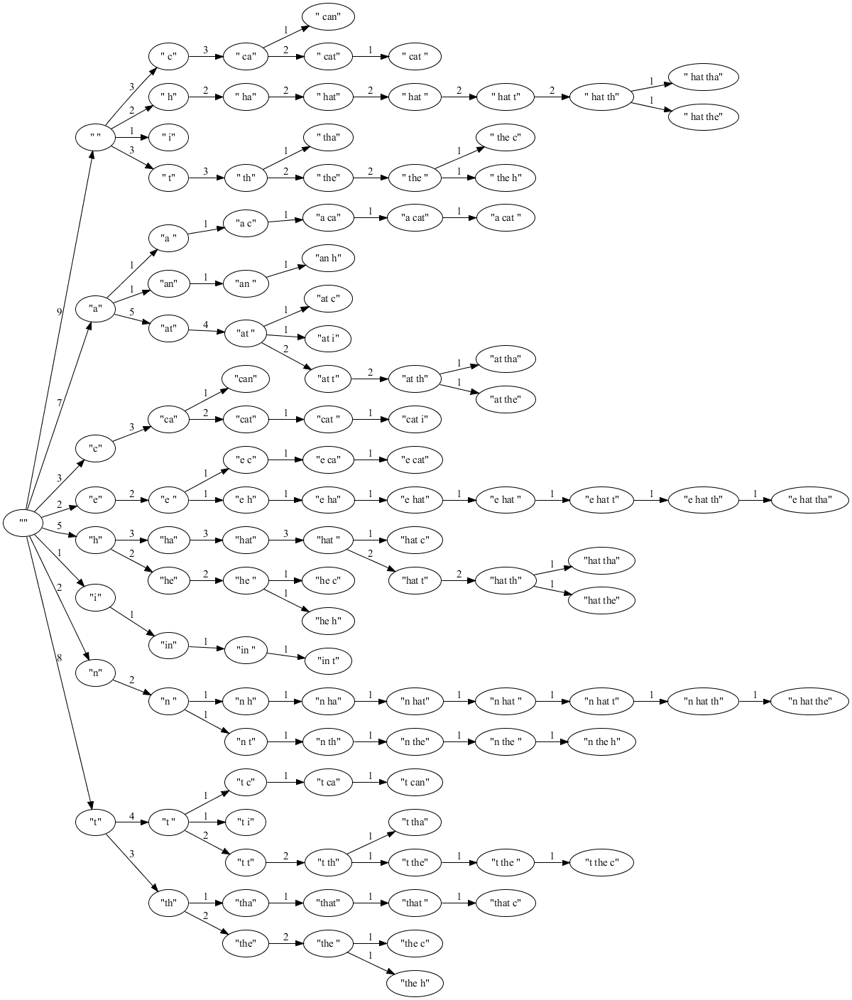

First, we load text into a model

Code from [TrieDemo.java:319](../../src/test/java/com/simiacryptus/util/text/TrieDemo.java#L319) executed in 0.24 seconds: 
```java
      CharTrie charTrie = CharTrieIndex.indexFulltext(trainingData, maxLevels, minWeight).truncate();
      print(charTrie);
      return charTrie;
```
Logging: 
```
    Total Indexed Document (KB): 0
    Total Node Count: 116
    Total Index Memory Size (KB): 2
    
```

Returns: 
```
    com.simiacryptus.text.CharTrie@e6cb1e26
```
The graph:

Code from [TrieDemo.java:326](../../src/test/java/com/simiacryptus/util/text/TrieDemo.java#L326) executed in 7.92 seconds: 
```java
      Node node = buildNode(trie.root(), maxLevels);
      Graph graph = graph().directed().generalAttr().with(RankDir.LEFT_TO_RIGHT).with(node);
      Renderer render = Graphviz.fromGraph(graph).width(1200).render(Format.PNG);
      return render.toImage();
```

Returns: 

